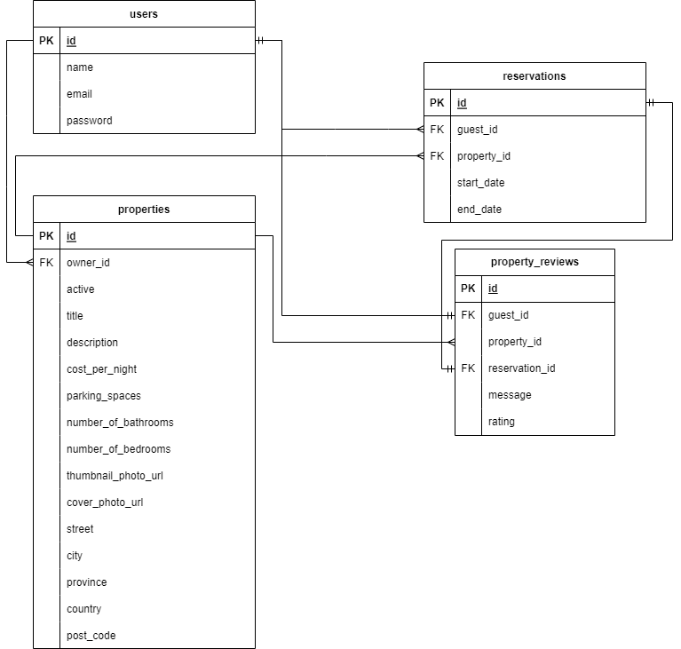

# LightBnB

## Description

The goal for this project was to update the template code to utilize the lightbnb database and properly pull data using node-postgres, SQL, and promises.

This project provided the opportunity to work with newly learned PostgreSQL, node-postgres, SQL, and develop Entity Relationship Diagrams (ERDs) while continuing to hone my JS skills (heavily relied on promises). 

*LightBnB Web Boilerplate Credits: [LightBnB_WebApp](https://github.com/lighthouse-labs/LightBnB_WebApp) by lighthouse-labs*

## Installation

1. Clone the repository:
```bash
git clone https://github.com/liisawiild/lightBnB.git
```

2. Navigate to the project directory:
```bash
cd lightbnb
```

3. Install dependencies (including dev):
```bash
npm install
```
### Dependencies
- bcrypt
- cookie-session
- ExpressJS: express
- Node-Postgres: pg

### Developer Dependencies
- nodemon


## Set-Up Your PostgreSQL Database 

1. Ensure the PostgreSQL server is running on your machine.

Apple:
```
  Start: brew services start postgresql
  Stop:  brew services stop postgresql
```
WSL2 & Vagrant:
```
  Start: sudo service postgresql start OR startpostgres
  Stop: sudo service postgresql stop
```
*For further troubleshooting, refer to [PostgreSQL Documentation](https://www.postgresql.org/download/)*

2. Create a lightbnb database in PostgreSQL and connect to it
```
CREATE DATABASE lightbnb;
\c lightbnb
```

3.  Import the migrations folder to create your database and tables
```
\i migrations/01_schema.sql
```

4. Import the data into your database
```
\i seeds/02_seeds.sql 
```


## Run Application
1. a) To start the server, run:
```
npm run start
```

1. b) To run the server with automatic restart on file changes (using nodemon), run:
```
npm run local
```

2. Open your web browser and navigate to [http://localhost:3000](http://localhost:3000).


## ERD & Project Structure
*Please refer to the README.md file within the LightBnB_WebApp folder for the project structure.* 

#### Entity Relationship Diagram (ERD) for the LightBnb Database


